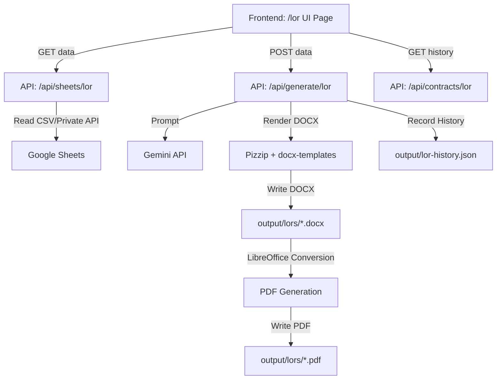

# 01. Project Overview — LOR Module

This document provides a high-level overview of the new **Letter of Recommendation (LOR)** module inside the **ZenZebra Contract Generator** ecosystem.

## 1. Module Purpose
The LOR Module enables the HR team at Bohemian Curations Private Limited (ZenZebra) to automatically generate professional, HR-approved Letters of Recommendation. It sources former interns' and employees' parameters directly from Google Form response sheets, drafts content using Gemini AI, allows manual adjustments, and outputs production-grade DOCX and PDF documents.

## 2. Business Logic
- **Automated Generation**: Eliminates manual draft writing by leveraging Google Forms data.
- **Verification & Control**: HR reviews and edits every dynamic field and final AI recommendation letter draft before compilation.
- **Absolute Isolation**: The module operates independently of the Brand Contract, Employee Contract, and Certificate modules. It maintains separate logic, API endpoints, numbering, and file history to prevent code regressions in existing workflows.

## 3. Module Architecture
The LOR module follows the Next.js 16 (App Router) + TypeScript structure:

## 4. UI Layout Overview
The UI page `/lor` uses a three-panel split design optimized for visual review:

| Left Panel (Width: 340px) | Center Panel (Flexible) | Right Panel (Flexible) |
|---|---|---|
| **Search & Sheet Loader**: Loader override input + list of candidates. **Employee Details**: Editable form inputs. **AI Parameters**: Key qualities & notes overrides. | **AI Editor**: Rich text/editable draft editor of the generated LOR body text. | **Live Preview**: Resizable container displaying the final LOR document preview. **Actions & History**: Generate buttons and list of historical records. |

## 5. Implementation Notes
- Keep all layouts responsive and follow the existing dark mode design system (using HSL CSS variables from `index.css`).
- Use the sidebar layout already wired in the root layout.
