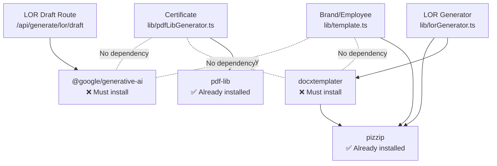

# 02. LOR Dependency Analysis

**Phase**: Implementation Planning  
**Scope**: All npm packages required for the LOR module  
**Date**: 2026-07-14

---

## 1. Dependency Overview

| Package | Status | Used By LOR | Used By Existing Modules |
|---|---|---|---|
| `@google/generative-ai` | ❌ NOT installed | ✅ AI draft generation | ❌ Not used |
| `docxtemplater` | ❌ NOT installed | ✅ DOCX placeholder rendering | ❌ Not used |
| `pizzip` | ✅ Already installed | ✅ DOCX zip container | ✅ Brand + Employee (via `template.ts`) |
| `next` | ✅ Already installed | ✅ Framework | ✅ All modules |
| `react` / `react-dom` | ✅ Already installed | ✅ UI | ✅ All modules |
| `lucide-react` | ✅ Already installed | ✅ Icons (ScrollText) | ✅ All modules |

---

## 2. Package: `@google/generative-ai`

### Why Needed
The LOR module generates AI-drafted recommendation body text using Google's Gemini API. This is the official SDK for server-side Gemini API calls.

### Where Used
| File | Usage |
|---|---|
| `web/app/api/generate/lor/draft/route.ts` | Import `GoogleGenerativeAI`, initialize with `GEMINI_API_KEY`, call `model.generateContent(prompt)` |

### Installation
```bash
npm install @google/generative-ai
```

### Version Strategy
Use latest stable version. The SDK is backward-compatible. Pin to the installed version in `package-lock.json`.

### Fallback Strategy
| Scenario | Behavior |
|---|---|
| Package not installed | TypeScript build fails — import cannot resolve |
| `GEMINI_API_KEY` missing | API returns 500: "AI service not configured. Set GEMINI_API_KEY in .env" |
| Gemini API unreachable | API returns 504: "AI service timed out. Please try again." |
| Rate limit exceeded | API returns 429: "AI service temporarily unavailable." |
| SDK deprecated | Replace with direct `fetch()` to Gemini REST endpoint |

### Impact on Existing Modules
**Zero**. No existing module uses Gemini. The package is imported only in the LOR draft route. `package.json` size increases by ~150KB (node_modules impact ~2MB).

### Vercel Compatibility
✅ Compatible. The `@google/generative-ai` SDK works in serverless environments. No binary dependencies. No native modules.

---

## 3. Package: `docxtemplater`

### Why Needed
The LOR module generates DOCX documents by replacing `{{PLACEHOLDER}}` tags inside a Word document template. `docxtemplater` is the standard library for this pattern.

### Where Used
| File | Usage |
|---|---|
| `web/lib/lorGenerator.ts` | Import `Docxtemplater`, load template via PizZip, call `doc.render(data)`, generate output buffer |

### Installation
```bash
npm install docxtemplater
```

### Version Strategy
Use latest stable version (v3.x). The API has been stable since v3.0.

### Why Not Reuse `template.ts`?
The existing Brand/Employee modules use `web/lib/template.ts`, which performs **direct XML string replacement** inside `<w:t>` nodes using PizZip. This approach:
- Does not support `linebreaks: true` (multi-paragraph AI content)
- Is tightly coupled to Brand/Employee placeholder names
- Uses custom gender pronoun logic

`docxtemplater` is cleaner for the LOR use case because:
- Native `linebreaks: true` converts `\n` to Word paragraph breaks
- Standard `{{TAG}}` syntax — no XML-level string manipulation
- No pronoun engine needed (LOR uses third person throughout)

### Fallback Strategy
| Scenario | Behavior |
|---|---|
| Package not installed | TypeScript build fails — import cannot resolve |
| Template file missing | API returns 500: "LOR template not found." |
| Placeholder tag missing from template | `docxtemplater` silently replaces with empty string (no crash) |
| Corrupted template | `PizZip` throws parse error → API returns 500 |

### Impact on Existing Modules
**Zero**. Brand/Employee continue using `template.ts`. Certificate uses `pdfLibGenerator.ts`. No existing file imports `docxtemplater`.

### Vercel Compatibility
✅ Compatible. Pure JavaScript, no native modules.

---

## 4. Package: `pizzip`

### Why Needed
DOCX files are ZIP archives. `pizzip` reads and writes the ZIP container that `docxtemplater` operates on.

### Where Used
| File | Usage |
|---|---|
| `web/lib/lorGenerator.ts` | `new PizZip(templateBuffer)` to load template, `doc.getZip().generate()` to produce output |
| `web/lib/template.ts` | Already used by Brand/Employee modules |

### Installation
**Already installed** — present in `package.json`.

### Fallback Strategy
Not applicable — the package is already installed and actively used.

### Impact on Existing Modules
**Zero**. LOR imports `pizzip` independently. The existing `template.ts` import is unaffected.

---

## 5. Dependency Graph



---

## 6. Pre-Installation Verification

Before running `npm install`, verify:

| Check | Command | Expected |
|---|---|---|
| Current build passes | `npm run build` | Zero errors |
| `pizzip` is present | Check `package.json` | ✅ Listed in dependencies |
| `docxtemplater` is absent | Check `package.json` | ❌ Not listed |
| `@google/generative-ai` is absent | Check `package.json` | ❌ Not listed |

### Installation Command
```bash
npm install docxtemplater @google/generative-ai
```

### Post-Installation Verification
| Check | Command | Expected |
|---|---|---|
| Build still passes | `npm run build` | Zero errors (no new imports yet) |
| `docxtemplater` in `package.json` | Inspect file | ✅ Listed |
| `@google/generative-ai` in `package.json` | Inspect file | ✅ Listed |
| `package-lock.json` updated | Check git diff | ✅ New entries |

---

## 7. Bundle Size Impact

| Package | Estimated Size (node_modules) | Serverless Bundle Impact |
|---|---|---|
| `@google/generative-ai` | ~2 MB | ~150 KB (tree-shaken) |
| `docxtemplater` | ~1 MB | ~200 KB (tree-shaken) |
| **Total** | ~3 MB | ~350 KB |

This is well within Vercel's 50 MB serverless function limit. Current bundle is ~15 MB.
