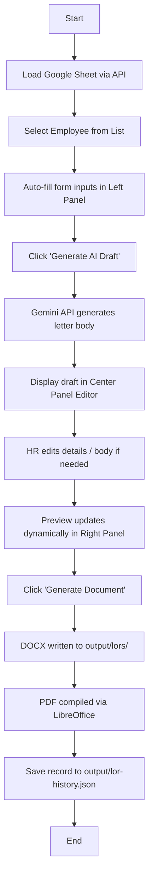

# 03. Complete Workflow — LOR Module

This document outlines the step-by-step lifecycle of Letter of Recommendation generation.

## 1. Step-by-Step Flow

## 2. State & Stages Definition

The LOR page manages its state through a main `generationState` variable:

1. **`idle`**: The initial state. No sheet is loaded, or a sheet is loaded but no employee has been selected.
2. **`loading_sheet`**: Sourcing and parsing rows from the Google Sheet.
3. **`selected`**: An employee has been chosen. Form fields are auto-filled, and the "Generate AI Draft" button is active.
4. **`generating_ai`**: Sending a request to the Gemini API and waiting for the recommendation draft response.
5. **`draft_ready`**: The AI draft is displayed in the editor, and the Live Preview is rendering.
6. **`compiling`**: Creating the DOCX file and converting it to PDF.
7. **`success`**: The files have been saved to disk, history logged, and the download links are available.
8. **`error`**: A validation, sheet loading, or compilation step has failed.

## 3. UI Status Indication
- **Loaders**: Spinners are shown during `loading_sheet`, `generating_ai`, and `compiling`.
- **Modals**: A confirmation modal is shown if a duplicate LOR is generated for the same candidate.
