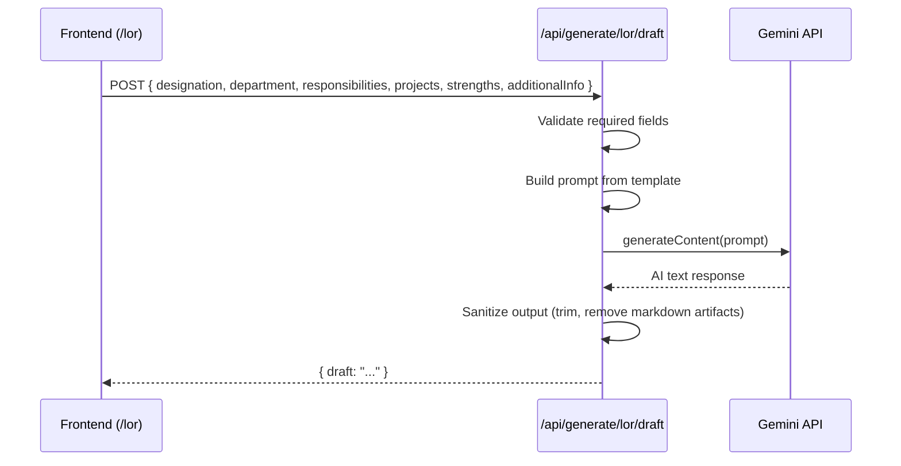

# 05. AI Generation Engine — LOR Module

This document defines how the Gemini AI API is used to generate professional LOR body content.

## 1. AI Provider
- **Engine**: Google Gemini API (`@google/generative-ai` SDK)
- **Model**: `gemini-2.0-flash` (or latest stable model)
- **Environment Variable**: `GEMINI_API_KEY` (stored in `.env`, never committed to git)

> [!IMPORTANT]
> The `@google/generative-ai` package is **not** included in the project's dependencies by default.
> It must be installed before the LOR module can function:
> ```bash
> npm install @google/generative-ai
> ```

## 2. Input Data Sent to AI

The following fields are extracted from the employee record and sent as structured context to the AI prompt:

| Field | Source | Required |
|---|---|---|
| `designation` | Google Sheet → Auto-filled → Editable | ✅ Yes |
| `department` | Google Sheet → Auto-filled → Editable | ✅ Yes |
| `employmentType` | Google Sheet → Auto-filled → Editable | ❌ Optional |
| `responsibilities` | Google Sheet → Auto-filled → Editable | ✅ Yes |
| `projects` | Google Sheet → Auto-filled → Editable | ✅ Yes |
| `strengths` | Google Sheet → Auto-filled → Editable | ✅ Yes |
| `additionalInfo` | Google Sheet → Auto-filled → Editable | ❌ Optional |

> [!IMPORTANT]
> The AI **never** receives the employee's name, email, phone, or dates. These are injected into the DOCX template separately. The AI only generates the body paragraphs.

## 3. Prompt Template

```text
You are a professional HR content writer for Bohemian Curations Private Limited (ZenZebra).

Write the BODY PARAGRAPHS ONLY of a formal Letter of Recommendation.

Do NOT include:
- "To Whom It May Concern" (already in the template)
- Employee name, dates, or designation introduction (already in the template)
- Signature block (already in the template)
- Any greetings or closings

Write ONLY the following sections as flowing paragraphs:

1. A brief summary of the employee's responsibilities based on:
   {{RESPONSIBILITIES}}

2. A summary of key projects and contributions based on:
   {{PROJECTS}}

3. A summary of professional qualities and strengths based on:
   {{STRENGTHS}}

4. A strong recommendation paragraph.

{{ADDITIONAL_INFO_BLOCK}}

Rules:
- Use professional, corporate, HR-approved language.
- Be positive but factual.
- Do NOT invent achievements, metrics, awards, or facts not provided.
- Do NOT hallucinate any information.
- Do NOT use bullet points. Use flowing prose paragraphs.
- Keep the total length between 150-250 words.
- Use third person ("the candidate", "they").
```

The `{{ADDITIONAL_INFO_BLOCK}}` is conditionally included:
```text
Additional context to incorporate naturally:
{{ADDITIONAL_INFO}}
```

### Generation Config
For consistent HR-grade output, use these Gemini API settings:

| Parameter | Value | Rationale |
|---|---|---|
| `temperature` | `0.4` | Low variability — formal HR tone must be consistent across letters |
| `topP` | `0.9` | Slight diversity in phrasing while staying professional |
| `maxOutputTokens` | `1024` | Sufficient for 150-250 word body text |

## 4. Anti-Hallucination Guardrails

| Rule | Implementation |
|---|---|
| No invented metrics | Prompt explicitly forbids "Do NOT invent achievements, metrics, awards" |
| No fake awards | Prompt explicitly forbids fabrication |
| Only supplied data | Prompt says "ONLY use the data provided above" |
| No external knowledge | System instruction: "Do not reference any external knowledge" |
| Length control | 150-250 word target prevents excessive generation |

## 5. API Call Architecture



## 6. Error Handling

| Scenario | Response |
|---|---|
| `GEMINI_API_KEY` missing | Return `500` with message: "AI service not configured. Set GEMINI_API_KEY in .env" |
| API rate limit exceeded | Return `429` with message: "AI service temporarily unavailable. Try again in a moment." |
| Empty AI response | Return `500` with message: "AI generated an empty response. Please try again." |
| Network timeout | Return `504` with message: "AI service timed out. Please try again." |

## 7. Output Format
The API returns a JSON object:
```json
{
  "draft": "During their tenure at ZenZebra, the candidate demonstrated..."
}
```
The frontend inserts this into the editable text area in the Center Panel.
