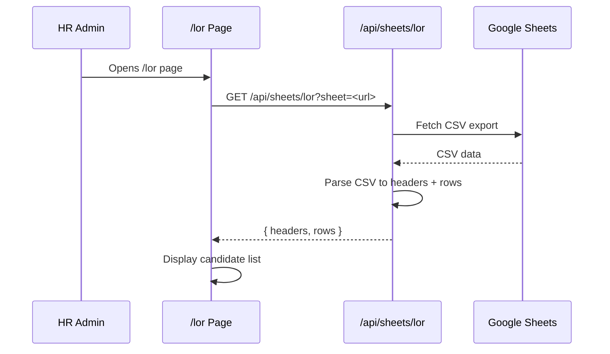
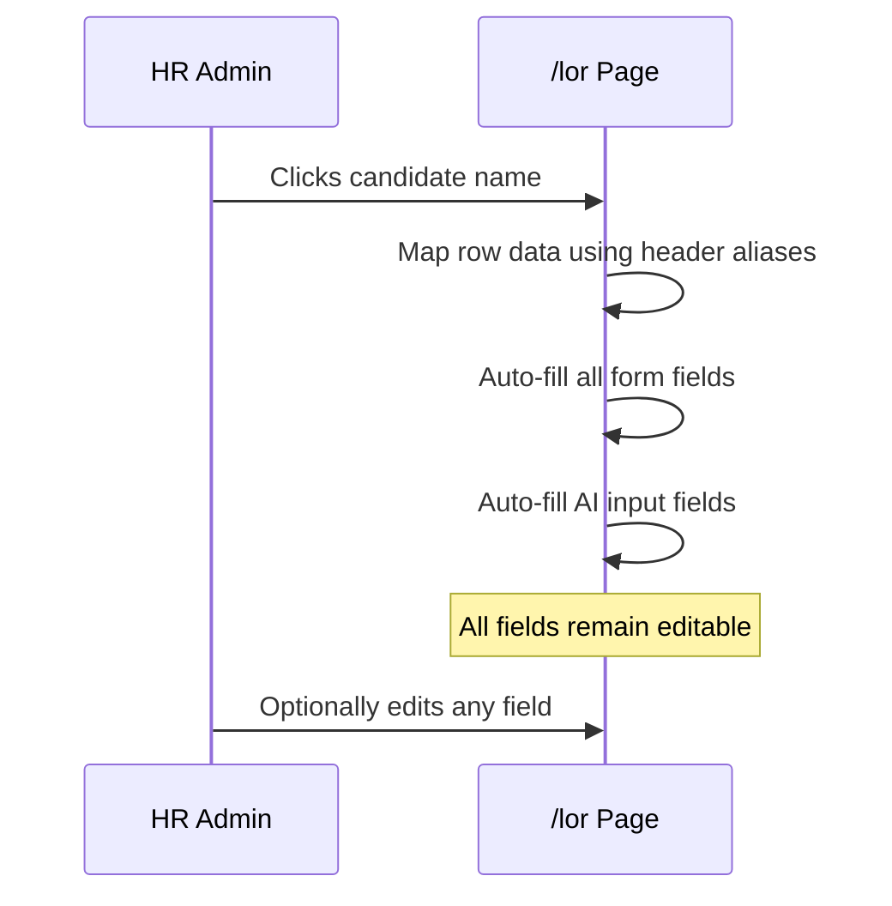
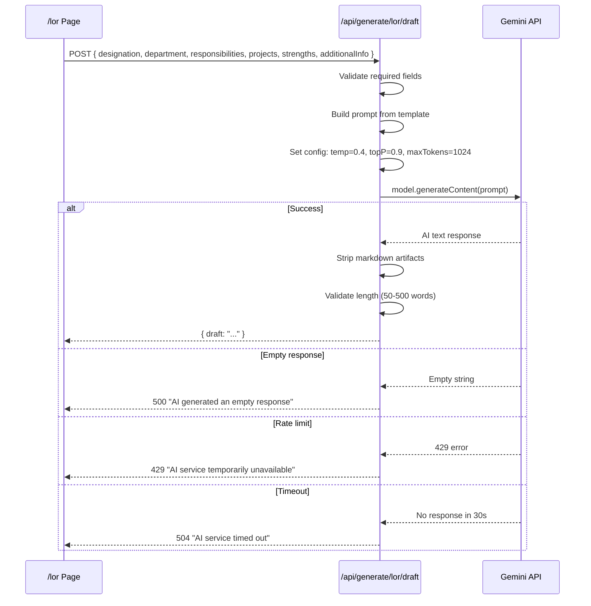
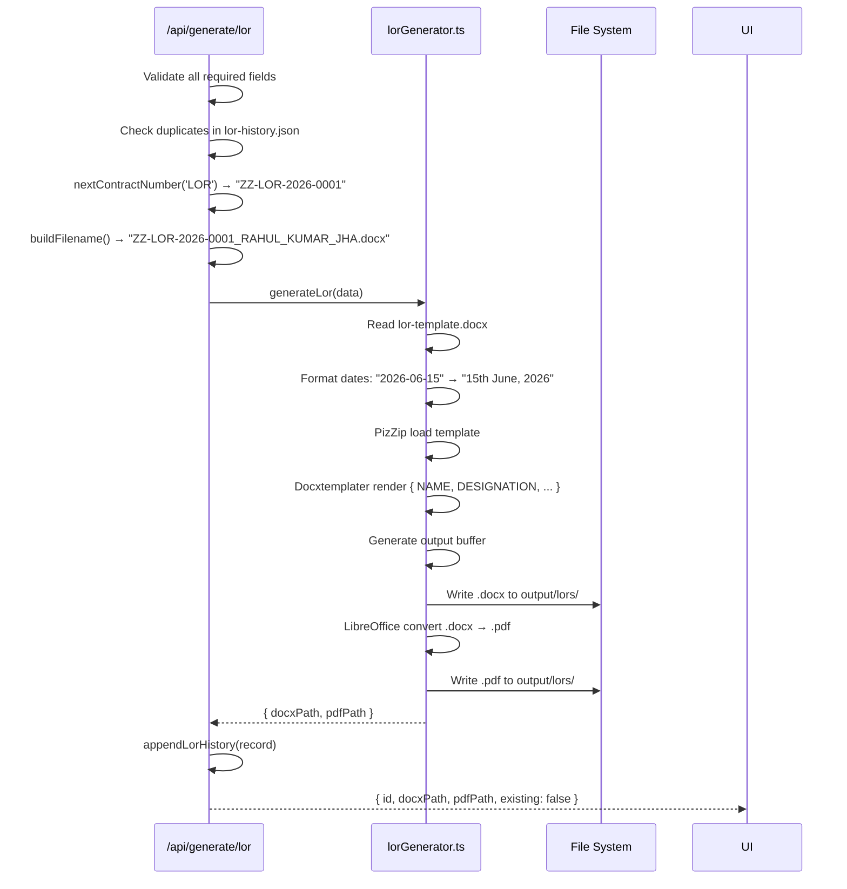

# 05. LOR AI Generation Flow

**Phase**: Implementation Planning  
**Scope**: Complete data flow from Google Sheet to final PDF, including AI generation and hallucination prevention  
**Date**: 2026-07-14

---

## 1. End-to-End Flow

```text
┌────────────────────────────────────────────────────────────────────────┐
│                                                                        │
│   Google Form  →  Google Sheet  →  /api/sheets/lor  →  /lor Page      │
│                                                                        │
│   HR selects candidate  →  Form auto-fills  →  HR edits fields         │
│                                                                        │
│   HR clicks "Generate AI Draft"                                        │
│       ↓                                                                │
│   AI Prompt Builder                                                    │
│       ↓                                                                │
│   POST /api/generate/lor/draft  →  Gemini API  →  AI Draft            │
│       ↓                                                                │
│   Center Panel Editor (HR reviews/edits)                               │
│       ↓                                                                │
│   HR clicks "Generate Document"                                        │
│       ↓                                                                │
│   POST /api/generate/lor                                               │
│       ↓                                                                │
│   ┌─────────────────────────────────────────┐                          │
│   │ 1. Validate fields                      │                          │
│   │ 2. Check for duplicates                 │                          │
│   │ 3. Generate contract number (ZZ-LOR-*)  │                          │
│   │ 4. Format dates (ordinal)               │                          │
│   │ 5. Render DOCX via docxtemplater        │                          │
│   │ 6. Convert to PDF via LibreOffice       │                          │
│   │ 7. Save to lor-history.json             │                          │
│   └─────────────────────────────────────────┘                          │
│       ↓                                                                │
│   output/lors/ZZ-LOR-2026-0001_NAME.docx                              │
│   output/lors/ZZ-LOR-2026-0001_NAME.pdf                               │
│                                                                        │
│   Download links available  →  History updated  →  Dashboard updated   │
│                                                                        │
└────────────────────────────────────────────────────────────────────────┘
```

---

## 2. Stage-by-Stage Breakdown

### Stage 1: Google Sheet Loading



### Stage 2: Candidate Selection & Form Fill



**Header Alias Resolution**:
- Each column header is normalized (lowercase, trim, remove special chars)
- Matched against alias arrays from `04_GOOGLE_SHEET_MAPPING.md`
- Unmatched columns are silently ignored

### Stage 3: AI Prompt Building

The prompt is assembled from 4 dynamic blocks + 1 conditional block:

```text
┌─────────────────────────────────────────────┐
│  SYSTEM: You are a professional HR writer   │
│  for Bohemian Curations Pvt Ltd (ZenZebra)  │
│                                             │
│  INSTRUCTION: Write BODY PARAGRAPHS ONLY    │
│                                             │
│  DO NOT include:                            │
│  - Salutation (in template)                 │
│  - Name/dates/intro (in template)           │
│  - Signature block (in template)            │
│                                             │
│  Write these sections:                      │
│  1. Responsibilities → {{RESPONSIBILITIES}} │
│  2. Projects → {{PROJECTS}}                 │
│  3. Strengths → {{STRENGTHS}}               │
│  4. Recommendation paragraph                │
│                                             │
│  [IF additionalInfo present]:               │
│  Additional context: {{ADDITIONAL_INFO}}    │
│                                             │
│  Rules:                                     │
│  - Professional, corporate, HR-approved     │
│  - Positive but factual                     │
│  - NO invented achievements/metrics         │
│  - NO hallucinated information              │
│  - NO bullet points — flowing prose         │
│  - 150-250 words                            │
│  - Third person ("the candidate", "they")   │
└─────────────────────────────────────────────┘
```

**Data sent to AI** (role data only — NO PII):

| Sent to Gemini | NOT Sent to Gemini |
|---|---|
| `designation` | `employeeName` |
| `department` | `email` |
| `employmentType` | `phone` |
| `responsibilities` | `joiningDate` |
| `projects` | `lastWorkingDate` |
| `strengths` | `signatoryName` |
| `additionalInfo` | `signatoryRole` |

### Stage 4: Gemini API Call



### Stage 4b: AI Failure Fallback

If the Gemini API call fails for any reason, the module must NOT be blocked. The UI handles this explicitly:

```text
HR clicks "Generate AI Draft"
        ↓
POST /api/generate/lor/draft

Gemini Reachable?
├── YES → AI Draft text populates Center Panel
│         HR can edit or use as-is
│         draftGeneratedByAI = true
│
└── NO  → UI shows banner:
          "AI draft unavailable. You can write the recommendation manually."
          Center Panel textarea remains empty but FULLY EDITABLE
          draftGeneratedByAI = false
          aiDraft = null
          HR writes draft manually
          ↓
          Generate LOR proceeds normally with manual draft
```

**Failure triggers that activate the fallback:**

| Trigger | HTTP Status | Fallback Behaviour |
|---|---|---|
| `GEMINI_API_KEY` missing | 500 | Show banner, enable manual mode |
| Gemini rate limit (429) | 429 | Show banner, enable manual mode |
| Gemini timeout (30s) | 504 | Show banner, enable manual mode |
| API key expired/invalid | 500 | Show banner, enable manual mode |
| Network unreachable | 500 | Show banner, enable manual mode |
| Empty AI response | 500 | Show banner, enable manual mode |

**Critical rule**: The "Generate Document" button is NEVER disabled based on whether AI succeeded. HR can always generate the DOCX with whatever draft text is in the editor (including manually typed text).

---

### Stage 5: Manual Editing

After the AI draft appears in the Center Panel (or after the AI failure banner, in manual-only mode):

| Action | Behavior |
|---|---|
| HR edits AI draft text | Preview updates instantly (300ms debounce) |
| HR edits form fields (name, dates) | Preview updates instantly |
| HR edits AI input fields (responsibilities, projects, strengths) | "Inputs changed" indicator appears, "Regenerate" button pulses |
| HR clicks "Regenerate" | New Gemini API call with updated inputs |
| HR writes entire draft from scratch | Fully supported — no validation on draft content |
| HR pastes external text | Fully supported |

### Stage 6: DOCX Generation



### Stage 7: PDF Conversion

```text
LibreOffice CLI:
  libreoffice --headless --convert-to pdf --outdir <output_dir> <docx_path>

Env var: LIBREOFFICE_PATH
  Windows: C:\Program Files\LibreOffice\program\soffice.exe
  Linux:   /usr/bin/libreoffice
  macOS:   /Applications/LibreOffice.app/Contents/MacOS/soffice

Fallback:
  If LibreOffice not available → pdfPath = null
  UI shows: "PDF generation unavailable. LibreOffice is not configured."

Timeout:
  Kill process after 60 seconds → return DOCX only
```

### Stage 8: History & Dashboard

```text
1. Record appended to lor-history.json (unshift → newest first)
2. Dashboard /api/contracts reads lor-history.json
3. LOR records normalized to ContractRecord shape (type: "lor")
4. Merged with Brand/Employee/Certificate records
5. Sorted newest-first
6. Frontend filters: contracts.filter(c => c.type === "lor").length
7. LOR metric card displays count
8. Activity table shows LOR entries with "lor" badge
```

---

## 3. Hallucination Prevention

### Prompt-Level Guards

| Guard | How It Works |
|---|---|
| **Data boundary** | Prompt explicitly states: "ONLY use the data provided above" |
| **No invention rule** | Prompt: "Do NOT invent achievements, metrics, awards, or facts not provided" |
| **No hallucination rule** | Prompt: "Do NOT hallucinate any information" |
| **No external knowledge** | System instruction: "Do not reference any external knowledge" |
| **Length control** | 150-250 word target prevents excessive generation where hallucination risk increases |
| **Structured sections** | Four defined sections (responsibilities, projects, strengths, recommendation) constrain output structure |

### Architecture-Level Guards

| Guard | How It Works |
|---|---|
| **PII isolation** | Name, email, phone, dates are never sent to the AI — injected into template separately |
| **Human-in-the-loop** | HR reviews and can edit every word of the AI output before final generation |
| **Editable draft** | The AI output is displayed in a textarea, not rendered directly — HR has full control |
| **Regeneration** | HR can regenerate as many times as needed until satisfied |
| **Manual override** | HR can write the entire letter body from scratch, bypassing AI entirely |

### Post-Generation Guards

| Guard | How It Works |
|---|---|
| **Word count check** | Reject AI responses under 50 words (likely empty/error) or over 500 words (likely runaway) |
| **Markdown stripping** | Remove `**bold**`, `# heading`, `* bullet`, `- list` artifacts from AI output |
| **No auto-send** | AI draft is NEVER automatically compiled into DOCX — HR must explicitly click "Generate Document" |

---

## 4. Data Flow Isolation

```text
                    ┌──────────────────────┐
                    │   Google Sheet       │
                    │   (LOR Responses)    │
                    └──────────┬───────────┘
                               │
                    ┌──────────▼───────────┐
                    │  /api/sheets/lor     │   ← STANDALONE (not sheets.ts)
                    └──────────┬───────────┘
                               │
            ┌──────────────────┼──────────────────┐
            │                  │                   │
   ┌────────▼────────┐ ┌──────▼──────┐  ┌────────▼────────┐
   │  Form Fields    │ │  AI Inputs  │  │  Live Preview   │
   │  (Left Panel)   │ │  → Gemini   │  │  (Right Panel)  │
   └────────┬────────┘ └──────┬──────┘  └────────┬────────┘
            │                  │                   │
            └──────────────────┼───────────────────┘
                               │
                    ┌──────────▼───────────┐
                    │  /api/generate/lor   │
                    └──────────┬───────────┘
                               │
              ┌────────────────┼────────────────┐
              │                │                │
    ┌─────────▼──────┐ ┌──────▼──────┐ ┌───────▼───────┐
    │  output/lors/  │ │ lor-history │ │ sequence.json │
    │  (DOCX + PDF)  │ │    .json    │ │   LOR key     │
    └────────────────┘ └─────────────┘ └───────────────┘
```

No data crosses into Brand, Employee, or Certificate pipelines at any point.
