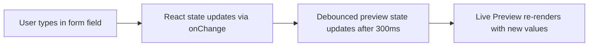

# 07. Manual Edit Flow — LOR Module

This document explains how every auto-filled and AI-generated field can be manually overridden by the HR administrator.

## 1. Core Principle
**Nothing is locked.** Every single field that is auto-populated from the Google Sheet or generated by AI remains fully editable. The HR administrator has absolute authority over the final output.

## 2. Editable Fields Matrix

| Field | Source | UI Element | Live Preview Updates |
|---|---|---|---|
| Employee Name | Google Sheet | `<Input>` text field | ✅ Instantly |
| Email | Google Sheet | `<Input>` text field | ❌ Not shown in preview |
| Phone | Google Sheet | `<Input>` text field | ❌ Not shown in preview |
| Department | Google Sheet | `<Input>` text field | ✅ Instantly |
| Designation | Google Sheet | `<Input>` text field | ✅ Instantly |
| Joining Date | Google Sheet | `<Input type="date">` | ✅ Instantly |
| Last Working Date | Google Sheet | `<Input type="date">` | ✅ Instantly |
| Employment Type | Google Sheet | `<Input>` text field | ❌ Not shown in preview |
| Responsibilities | Google Sheet | `<Textarea>` | ❌ Used for AI input |
| Projects | Google Sheet | `<Textarea>` | ❌ Used for AI input |
| Strengths | Google Sheet | `<Textarea>` | ❌ Used for AI input |
| Additional Info | Google Sheet | `<Textarea>` | ❌ Used for AI input |
| AI Draft Body | AI Generation | `<Textarea>` (large, center panel) | ✅ Instantly |
| Signatory Name | Default Config | `<Input>` text field | ✅ Instantly |
| Signatory Role | Default Config | `<Input>` text field | ✅ Instantly |

## 3. Edit → Preview Data Flow

- **Debounce timer**: 300ms. Prevents excessive re-renders during fast typing.
- **State management**: All fields are managed via individual `useState` hooks in the page component.

## 4. AI Re-generation After Edits
If the HR administrator edits the AI input fields (Responsibilities, Projects, Strengths, Additional Info) after an AI draft has already been generated:
- The existing AI draft is **NOT** automatically cleared.
- A visual indicator appears: *"Input fields have changed since the last AI draft was generated."*
- The "Regenerate AI Draft" button becomes highlighted/pulsing to suggest regeneration.
- Clicking it sends a new request to the Gemini API with the updated fields.

## 5. Manual Draft Override
The AI draft text area in the Center Panel supports:
- Full manual typing (HR can write the entire letter body from scratch).
- Copy-paste from external sources.
- Undo/Redo via browser defaults (`Ctrl+Z` / `Ctrl+Y`).
- The system does **not** validate the content of the draft — it is treated as raw text for template injection.
