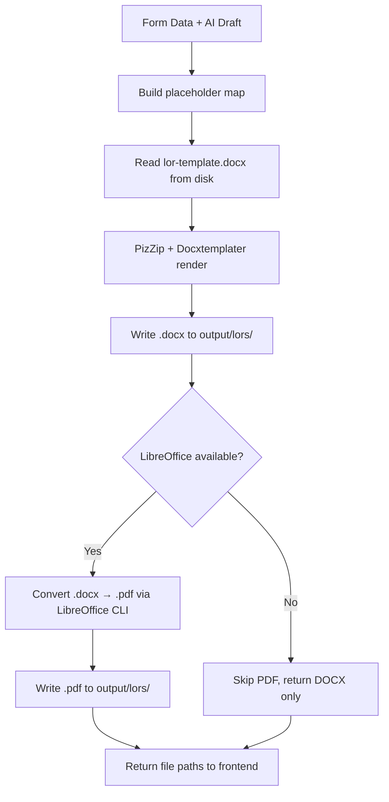

# 09. DOCX & PDF Generation — LOR Module

This document defines the binary file compilation pipeline from template rendering to final PDF output.

## 1. Generation Pipeline



## 2. DOCX Generation

### Step-by-step:
1. Read the template file from `web/templates/lor/lor-template.docx`.
2. Build the placeholder data object from the validated form fields.
3. Use `PizZip` to load the `.docx` binary as a zip archive.
4. Use `Docxtemplater` to replace all `{{PLACEHOLDER}}` tags.
5. Generate the output buffer using `doc.getZip().generate({ type: "nodebuffer" })`.
6. Write the buffer to disk at `output/lors/ZZ-LOR-YYYY-XXXX.docx`.

### File Naming Convention:
```text
ZZ-LOR-2026-0001_RAHUL_KUMAR_JHA.docx
```
- Prefix: `ZZ-LOR`
- Year: current year
- Sequence: zero-padded 4-digit counter from `sequence.json` (key: `LOR` → `{ YEAR: count }`)
- Suffix: employee name (uppercase, spaces replaced with underscores)

## 3. PDF Generation

### Strategy: LibreOffice CLI Conversion
The system uses LibreOffice in headless mode to convert the rendered DOCX to PDF:

```bash
libreoffice --headless --convert-to pdf --outdir <output_dir> <docx_path>
```

### Environment Variable:
```text
LIBREOFFICE_PATH=/usr/bin/libreoffice
```
- On Windows: `C:\\Program Files\\LibreOffice\\program\\soffice.exe`
- On macOS: `/Applications/LibreOffice.app/Contents/MacOS/soffice`
- Configured in `.env` at the project root.

### Fallback Behavior:
If `LIBREOFFICE_PATH` is not set or the binary is not found:
- The system generates **only** the DOCX file.
- The API response includes `pdfPath: null`.
- The UI shows a warning: *"PDF generation unavailable. LibreOffice is not configured."*

## 4. File Output Summary

| Output | Path | Example |
|---|---|---|
| DOCX | `output/lors/ZZ-LOR-2026-0001_RAHUL_KUMAR_JHA.docx` | Generated always |
| PDF | `output/lors/ZZ-LOR-2026-0001_RAHUL_KUMAR_JHA.pdf` | Generated if LibreOffice available |

## 5. Concurrency Safety
- The `output/lors/` directory is created with `fs.mkdirSync(dir, { recursive: true })` before any write.
- File writes use `fs.writeFileSync()` to ensure atomic completion.
- The sequence counter in `sequence.json` is read-modify-written atomically per request.

## 6. Download API
After generation, the frontend receives the file paths and uses the existing `/api/download` endpoint:
```text
GET /api/download?folder=lors&file=ZZ-LOR-2026-0001_RAHUL_KUMAR_JHA.docx
GET /api/download?folder=lors&file=ZZ-LOR-2026-0001_RAHUL_KUMAR_JHA.pdf
```

> [!NOTE]
> The download endpoint uses two query parameters: `folder` (the subdirectory under `output/`) and `file` (the filename only, not a full path). This matches the existing Brand/Employee/Certificate download pattern.
