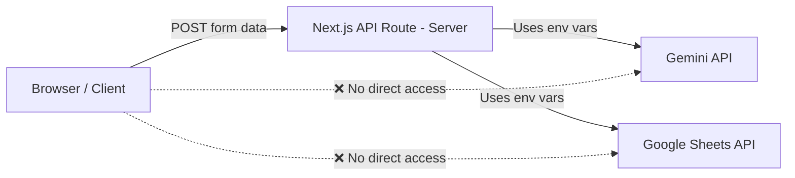

# 14. Security Rules — LOR Module

This document defines the security boundaries and credential management rules for the LOR module.

## 1. Credential Storage

| Credential | Storage Location | Access Method |
|---|---|---|
| `GEMINI_API_KEY` | `.env` file (project root) | `process.env.GEMINI_API_KEY` |
| `GOOGLE_LOR_SHEET_ID` | `.env` file (project root) | `process.env.GOOGLE_LOR_SHEET_ID` |
| `GOOGLE_SERVICE_ACCOUNT_JSON` | `.env` file or `credentials.json` | `process.env.GOOGLE_SERVICE_ACCOUNT_JSON` or file read |

## 2. Never Expose Rules

The following must **never** appear in:
- Client-side JavaScript bundles
- API response bodies
- Browser console logs
- Git commits

| Secret | Type |
|---|---|
| `GEMINI_API_KEY` | AI API authentication key |
| `GOOGLE_SERVICE_ACCOUNT_JSON` | Google Cloud service account private key |
| `credentials.json` | Service account key file |

## 3. Server-Side Only Access

All sensitive operations run exclusively on the server:

- The browser sends form data to `/api/generate/lor/draft`.
- The API route reads `GEMINI_API_KEY` from `process.env` on the server.
- The browser **never** has access to the API key.

## 4. Google Sheet Access Security

### Public Sheet (Preferred)
- The sheet is shared as "Anyone with the link — Viewer".
- Data is fetched via CSV export URL (no authentication required).

### Private Sheet (Service Account Fallback)
- If the sheet is not public, the system falls back to service account authentication.
- The service account key is read from `GOOGLE_SERVICE_ACCOUNT_JSON` env var or `credentials.json` file.
- The service account email must be added as a Viewer on the Google Sheet.

## 5. Input Sanitization

| Input | Sanitization Rule |
|---|---|
| Employee Name | Trim whitespace, max 200 characters |
| Designation | Trim whitespace, max 200 characters |
| AI Draft Text | No HTML tags allowed (strip if present) |
| File paths | Validated against path traversal (`../`) |
| Sheet URL | Must match Google Sheets URL pattern |

## 6. Rate Limiting Considerations

| Concern | Mitigation |
|---|---|
| Gemini API rate limits | Catch 429 errors and return user-friendly message |
| Rapid form submissions | Disable "Generate" button during processing |
| Sheet fetch spam | Cache sheet data for 60 seconds server-side |

## 7. File Access Control
- Generated files in `output/lors/` are served through the `/api/download` endpoint.
- The download endpoint validates that the requested file path starts with `output/` and does not contain `..` path traversal.
