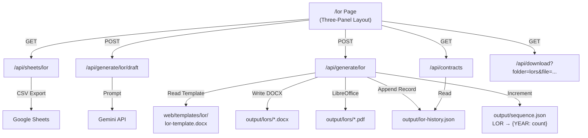

# FINAL LOR ARCHITECTURE
## Post-Audit Definitive Reference — v2.0

**Status**: All 4 critical conflicts resolved. Ready for implementation planning.  
**Last Updated**: 2026-07-14  
**Supersedes**: All assumptions in original docs that conflicted with actual codebase.

---

## 1. Module Identity

| Property | Value |
|---|---|
| Module Name | Letter of Recommendation (LOR) |
| URL Path | `/lor` |
| Contract Prefix | `ZZ-LOR` |
| Numbering Key | `LOR` (uppercase, in `sequence.json`) |
| History File | `output/lor-history.json` |
| Output Directory | `output/lors/` |
| Template | `web/templates/lor/lor-template.docx` |

---

## 2. System Architecture



---

## 3. Sequence Numbering (CORRECTED)

The project uses a **nested** `{ TYPE: { YEAR: count } }` schema in `output/sequence.json`:

```json
{
  "BRAND": { "2026": 30 },
  "EMP":   { "2026": 44 },
  "CERT":  { "2026": 0 },
  "LOR":   { "2026": 0 }
}
```

### Key Rules
- Key is `LOR` (UPPERCASE) — matches `nextContractNumber('LOR')`
- Year sub-key is auto-created per calendar year
- Counter never resets, never reuses numbers
- Function signature change required in `web/lib/contractNumber.ts`:
  ```typescript
  // Current:
  export function nextContractNumber(type: 'BRAND' | 'EMP' | 'CERT'): string {
  // Required:
  export function nextContractNumber(type: 'BRAND' | 'EMP' | 'CERT' | 'LOR'): string {
  ```

---

## 4. API Endpoints

### 4.1 Sheet Loader
| Method | Path | Purpose |
|---|---|---|
| `GET` | `/api/sheets/lor` | Load candidate rows from Google Sheet |

**Query Params**: `sheet` (optional URL override), `refresh` (boolean)  
**Response**: `{ headers: string[], rows: string[][] }`  
**Env Fallback**: `GOOGLE_LOR_SHEET_ID` + `GOOGLE_LOR_SHEET_GID`

> [!IMPORTANT]
> The existing `fetchRawRows()` in `sheets.ts` does NOT support `'lor'` type. Use a **standalone fetcher** in the route file (Option A) to maintain module isolation.

### 4.2 AI Draft Generator
| Method | Path | Purpose |
|---|---|---|
| `POST` | `/api/generate/lor/draft` | Generate AI recommendation body via Gemini |

**Request**: `{ designation, department, employmentType?, responsibilities, projects, strengths, additionalInfo? }`  
**Response**: `{ draft: "..." }`  
**Config**: `temperature: 0.4`, `topP: 0.9`, `maxOutputTokens: 1024`

### 4.3 Document Generator
| Method | Path | Purpose |
|---|---|---|
| `POST` | `/api/generate/lor` | Compile DOCX + PDF, save to history |

**Request**: `{ employeeName, designation, department, email, joiningDate, lastWorkingDate, employmentType, aiDraft, signatoryName, signatoryRole, forceDuplicate }`  
**Response**: `{ id, docxPath, pdfPath, existing }`

### 4.4 Dashboard (Shared)
| Method | Path | Purpose |
|---|---|---|
| `GET` | `/api/contracts` | Combined document list (all modules) |

**Response**: `{ contracts: [...all records normalized...] }`  
**LOR records** are normalized and merged into the same array as Brand/Employee/Certificate.  
**Counts** are computed client-side: `contracts.filter(c => c.type === "lor").length`

### 4.5 Download (Shared)
| Method | Path | Purpose |
|---|---|---|
| `GET` | `/api/download` | Stream a generated file |

**Query Params**: `folder=lors` + `file=ZZ-LOR-2026-0001_RAHUL_KUMAR_JHA.docx`  
**NOT**: `file=output/lors/...` (full path — this is WRONG)

---

## 5. File System Layout

```text
CONTRACT TOOL/
├── .env                              ← Add: GOOGLE_LOR_SHEET_ID, GEMINI_API_KEY
├── output/
│   ├── lors/                         ← Generated DOCX + PDF files
│   │   ├── ZZ-LOR-2026-0001_RAHUL_KUMAR_JHA.docx
│   │   └── ZZ-LOR-2026-0001_RAHUL_KUMAR_JHA.pdf
│   ├── lor-history.json              ← LOR generation records (array of objects)
│   └── sequence.json                 ← { "LOR": { "2026": n } }
│
└── web/
    ├── app/
    │   ├── lor/
    │   │   └── page.tsx              ← Three-panel LOR UI
    │   └── api/
    │       ├── sheets/lor/
    │       │   └── route.ts          ← GET: Sheet loader
    │       ├── generate/lor/
    │       │   ├── route.ts          ← POST: DOCX + PDF compilation
    │       │   └── draft/
    │       │       └── route.ts      ← POST: Gemini AI draft
    │       ├── contracts/
    │       │   └── route.ts          ← GET: Dashboard (add LOR normalization)
    │       └── download/
    │           └── route.ts          ← GET: File download (shared, no changes)
    ├── lib/
    │   ├── lorGenerator.ts           ← NEW: DOCX rendering + PDF conversion
    │   ├── lorStore.ts               ← NEW: lor-history.json read/write
    │   └── contractNumber.ts         ← MODIFY: Add 'LOR' to type union
    └── templates/
        └── lor/
            └── lor-template.docx     ← NEW: DOCX template with placeholders
```

---

## 6. Isolation Matrix

| Dimension | Brand | Employee | Certificate | LOR |
|---|---|---|---|---|
| **Page** | `/brand` | `/employee` | `/certificate` | `/lor` |
| **Sheet API** | `/api/sheets/brand` | `/api/sheets/employee` | `/api/sheets/certificate` | `/api/sheets/lor` |
| **Generate API** | `/api/generate/brand` | `/api/generate/employee` | `/api/generate/certificate` | `/api/generate/lor` |
| **Numbering Key** | `BRAND` | `EMP` | `CERT` | `LOR` |
| **History File** | `contracts.json` | `contracts.json` | `certificates.json` | `lor-history.json` |
| **Output Dir** | `output/brands/` | `output/employees/` | `output/certificates/` | `output/lors/` |
| **Template** | `brand-contract-*.docx` | `employee-contract-*.docx` | `certificates/` | `lor/lor-template.docx` |
| **Generator Lib** | `template.ts` | `template.ts` | `pdfLibGenerator.ts` | `lorGenerator.ts` |

**Zero cross-module imports. Zero shared history files. Zero shared templates.**

---

## 7. Dependencies

### Already Installed
| Package | Used For |
|---|---|
| `pizzip` | DOCX zip container read/write |
| `lucide-react` | UI icons (ScrollText, Scroll) |
| `next` | Framework |

### Must Install Before Implementation
| Package | Used For | Command |
|---|---|---|
| `docxtemplater` | DOCX placeholder rendering | `npm install docxtemplater` |
| `@google/generative-ai` | Gemini API SDK | `npm install @google/generative-ai` |

---

## 8. Environment Variables

### Must Add to `.env`
```env
# LOR Module
GOOGLE_LOR_SHEET_ID=<sheet-id>
GOOGLE_LOR_SHEET_GID=<gid>
GEMINI_API_KEY=<api-key>
```

### Already Present (shared)
```env
LIBREOFFICE_PATH=C:\Program Files\LibreOffice\program\soffice.exe
CONTRACT_PREFIX=ZZ
```
